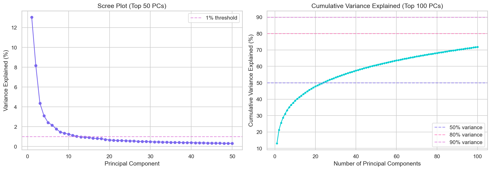
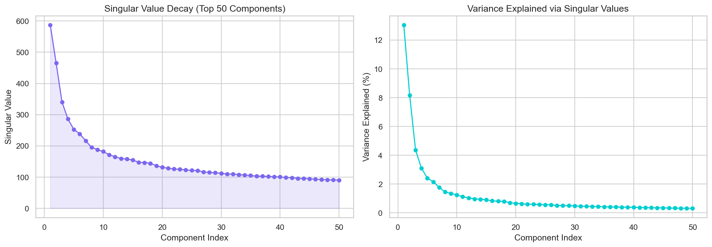
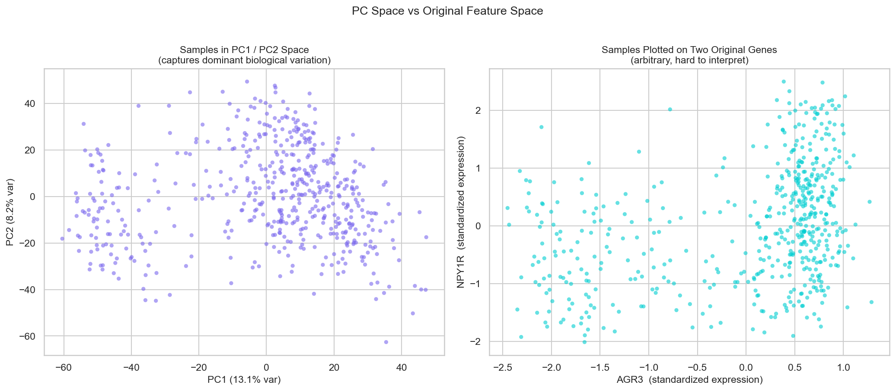
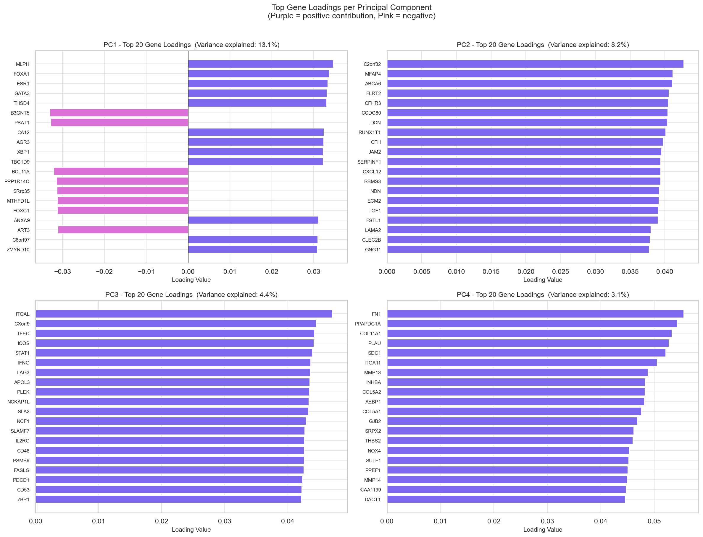
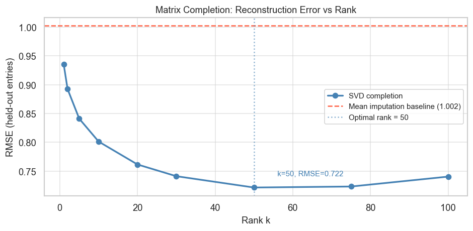
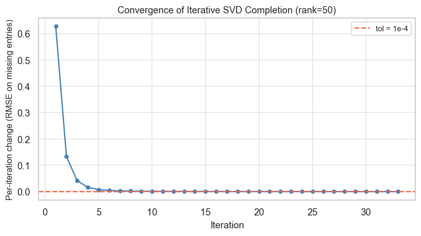
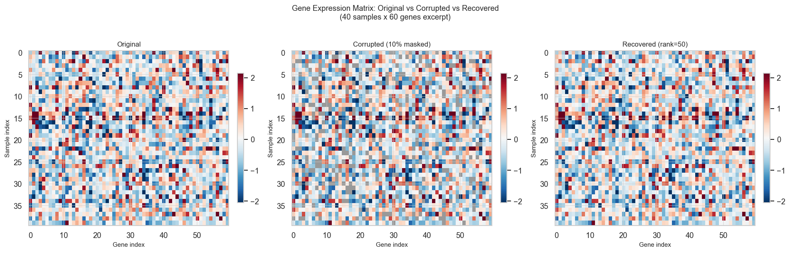
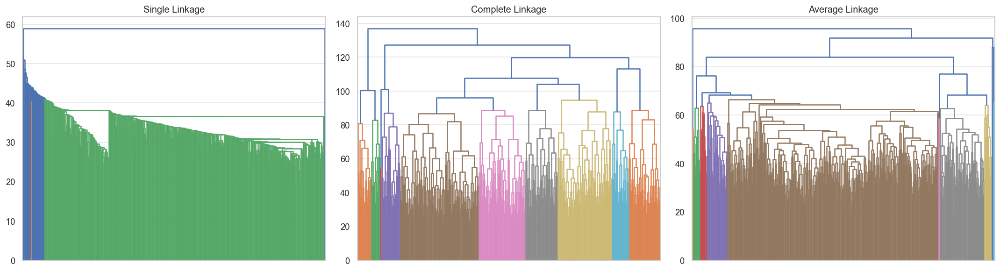
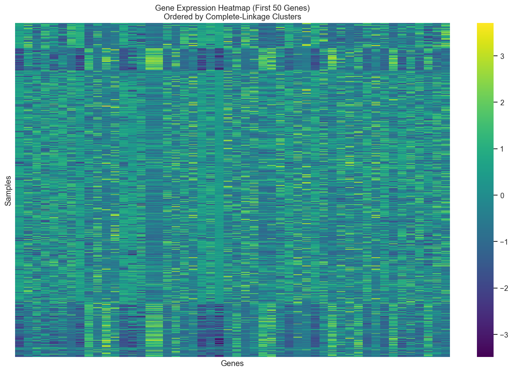

# Can an Algorithm Rediscover What Oncologists Took Decades to Find?

---

> **Revision (June 2026):** This post was updated following graded review to address rubric categories identified as incomplete. Five additions have been made:
>
> - **Theoretical Background** section added (rubric: *Theoretical Background*, 0/4 pts): covers the mathematical formulations for SVD/PCA, K-Means, hierarchical clustering, and matrix completion. Located below the Approach overview.
> - **Methodology** section added (rubric: *Methodology*, 0/3 pts): describes the data preprocessing pipeline and the specific configuration of each method. Located immediately after Theoretical Background.
> - **U and V matrix interpretation** added to the PCA results section (rubric: *Specific Criteria B*, interpretation of the U and V* matrices from SVD in the context of the data).
> - **Cluster characterization** added to the K-Means results section (rubric: *Specific Criteria D*, which observations belong to each cluster, what makes them similar, and how the groups differ).
> - **Cluster centroid table** added to the K-Means results section (rubric: *Code: Model Comparison and Interpretation*).

---

## The Question

Breast cancer is not one disease. Oncologists have identified at least four distinct molecular subtypes: **Luminal A**, **Luminal B**, **HER2-enriched**, and **Triple-Negative**. Each behaves differently, responds differently to treatment, and carries a different prognosis. Identifying these subtypes took decades of clinical research and required knowing exactly what to look for.

We asked a simpler question: **what if you gave an algorithm 17,000 gene measurements from 529 tumor samples and absolutely no other information? Could it find the same groupings on its own?**

---

## The Data

We used publicly available gene expression data from **The Cancer Genome Atlas (TCGA)**, a landmark NIH project that collected and published data from thousands of cancer patients across many cancer types. Our dataset contains 529 breast tumor samples. Every entry is a number representing how actively a particular gene was expressing itself in that tumor sample.

The full dataset covers 17,814 genes per patient. That is a lot of measurements to work with directly, and most of those genes turn out to carry very little information that distinguishes one patient from another. Before running any algorithms, we narrowed the dataset down to the 5,000 genes that varied the most across patients. Those 5,000 genes account for 64.4% of the total variation in the dataset. The rest contribute very little and would mostly add noise. Our job was to find hidden patterns in those numbers, with no hints about diagnosis, subtype, or outcome.

### A note on the numbers themselves

The values in this dataset are not raw counts. They have already been adjusted using a logarithmic scale and centered near zero. That matters for the analysis. Gene activity can range enormously from one gene to another. Without this adjustment, a small number of extremely active genes would dominate the results and drown out meaningful variation in the rest. The adjustment compresses that range, puts all measurements on a more comparable scale, and makes the data behave consistently across all 5,000 genes.

### What the data inspection revealed

When we examined the dataset carefully, we found 1,497 entries out of 9.4 million recorded as missing, less than 0.02% of the data. The missing values were not scattered randomly. They clustered in a specific group of genes that showed consistently undetectable activity across all 529 samples.

The reason for this is straightforward. The measurement instrument works by detecting a signal from each gene. When a gene produces no detectable output in a sample, the instrument records nothing rather than a near-zero number. Think of it like a scale that can only measure weights above one gram: if you place something too light on it, you do not get a reading of 0.0001 grams, you get no reading at all. Recording nothing is more honest than recording a number the instrument cannot reliably deliver.

This pattern tells us something useful: the missing values are not the result of data corruption or random chance. They come from genes that consistently had nothing to measure in this particular set of tumor samples. Because we were keeping only the most variable genes anyway, most of those low-signal genes were dropped during filtering, taking most of the missing values with them. Any remaining gaps were filled with the average value observed for that gene across the other samples.

We also ran a basic quality check on the 529 samples to look for any that were clearly unusual. We flagged 2 samples with unusually low average activity and 3 with unusually high variation. The deviations were small, suggesting natural variation across patients rather than a data problem, so all 529 samples were kept for the analysis.

> **Data source:** [Kaggle: Gene Expression Profiles of Breast Cancer](https://www.kaggle.com/datasets/orvile/gene-expression-profiles-of-breast-cancer) (originally from TCGA)

---

## Our Approach

We applied four unsupervised learning methods, which are algorithms that learn structure from data without any labels:

| Method | What it does |
|--------|-------------|
| **PCA / SVD** | Compresses 17,000 dimensions down to a handful that capture the most variation |
| **Matrix Completion** | Recovers missing measurements using the low-rank structure of the data |
| **K-Means Clustering** | Partitions patients into groups based on similarity in gene expression |
| **Hierarchical Clustering** | Builds a tree of relationships between patients, revealing nested structure |

---

## Theoretical Background

Each method in this project is grounded in established linear algebra and optimization theory. This section describes the mathematical basis for each approach.

### Singular Value Decomposition and Principal Component Analysis

Singular Value Decomposition (SVD) is the mathematical engine behind PCA. Any real matrix **X** of shape n x p can be factored as:

`X = U Σ Vᵀ`

where **U** is an n x n orthogonal matrix whose columns are the left singular vectors, **Σ** is an n x p rectangular diagonal matrix with singular values σ₁ ≥ σ₂ ≥ ... ≥ 0 along the diagonal, and **Vᵀ** is a p x p orthogonal matrix whose rows are the right singular vectors (the principal directions).

For dimensionality reduction, we compute a truncated SVD, keeping only the top r singular triplets. The resulting rank-r approximation captures the maximum possible variance in r components. No other rank-r matrix is a closer representation of the original data in terms of total squared error. The proportion of total variance explained by the i-th component is:

`proportion_i = σᵢ² / (σ₁² + σ₂² + ... + σₚ²)`

The PCA-reduced matrix is formed by projecting the data onto the top-r right singular vectors: `X_reduced = X Vᵣ`, producing an n x r matrix. In our case this reduces the 529 x 5,000 input to 529 x 24.

Computationally, we used `scipy.sparse.linalg.svds`, which computes only the leading singular triplets without factoring the full matrix. This is substantially more efficient than computing the full SVD when only a small number of components are needed.

### K-Means Clustering

K-Means solves the following optimization problem: given n data points and a target cluster count k, find cluster assignments C₁, ..., Cₖ and centroids μ₁, ..., μₖ that minimize the within-cluster sum of squares (WCSS):

`minimize  Σᵢ₌₁ᵏ Σ_{x ∈ Cᵢ} ||x - μᵢ||²`

The algorithm alternates between two steps until convergence:

1. **Assignment step**: assign each point to its nearest centroid, `argmin_i ||x - μᵢ||²`
2. **Update step**: recompute each centroid as the mean of its assigned points, `μᵢ = mean(Cᵢ)`

WCSS decreases monotonically at each iteration, guaranteeing convergence. However, the solution may be a local rather than global minimum, depending on the initialization. To reduce this sensitivity, we ran the algorithm with `n_init=20` independent random starting configurations and retained the solution with the lowest total WCSS.

The number of clusters k is a hyperparameter, not estimated from data. We evaluated candidate values using the elbow method (WCSS vs. k) and silhouette analysis.

### Hierarchical Clustering

Hierarchical agglomerative clustering builds a dendrogram by iteratively merging the two closest clusters, starting from n singletons. The full merge history is recorded in the dendrogram, which yields a flat cluster solution at any value of k without rerunning the algorithm, which is useful when comparing multiple cut points.

The critical design choice is the linkage criterion, which defines the distance between two clusters from pairwise point distances:

- **Single linkage**: the distance between clusters A and B is the minimum distance between any pair of points across A and B. This tends to produce elongated, chain-like clusters.
- **Complete linkage**: the maximum distance between any pair of points across A and B. This tends to produce more compact, balanced clusters.
- **Average linkage**: the mean of all pairwise distances between points in A and B, providing a balance between the two extremes.

A flat partition of k groups is obtained by cutting the dendrogram at the height that produces exactly k connected components, equivalent to removing the k-1 longest branches. The choice of linkage criterion strongly influences the resulting cluster shapes and sizes.

### Matrix Completion via Iterative SVD

Matrix completion recovers an unobserved matrix from partial observations. The approach rests on a low-rank assumption: the true matrix X has rank r much smaller than min(n, p), meaning most of its structure can be described by a small number of latent factors. The formal problem asks for the lowest-rank matrix that matches all observed entries. Because rank minimization is NP-hard, this is relaxed in practice by minimizing the nuclear norm `||X||_* = Σᵢ σᵢ(X)`, the sum of singular values, as a convex proxy for rank.

We implemented the iterative SVD algorithm:

1. Initialize missing entries with column means
2. Compute the rank-r truncated SVD: `X̂ = Uᵣ Σᵣ Vᵣᵀ`
3. Update only the missing entries with the approximation: `X_missing ← X̂_missing` (observed entries are held fixed throughout)
4. Repeat until the change in imputed values falls below a convergence threshold

The rank r is the key tuning parameter. Too small and the model underfits the observed entries; too large and it begins fitting noise in the observed data, which degrades generalization to the held-out entries. We selected r by sweeping over candidate values and evaluating RMSE on entries masked before fitting.

---

## Methodology

### Data Preprocessing

The raw dataset was loaded as a 529 x 17,814 matrix. Expression values were already log₂-normalized and mean-centered in the source data. Our preprocessing pipeline (Notebook 1) proceeded in three steps:

1. **Gene selection**: variance was computed for each gene across all 529 samples and genes were ranked in descending order. The top 5,000 genes by variance were retained. These account for 64.4% of total dataset variation; the remaining 12,814 genes contribute minimal discriminating information and would add noise to subsequent steps.

2. **Missing value imputation**: after filtering, 716 missing values remained across the 529 x 5,000 matrix (spread across 162 genes). Each was replaced with the column mean for that gene. Given the very low rate and the non-random pattern of missingness described in the Data section, mean imputation introduces negligible error.

3. **Standardization**: each gene column was scaled to zero mean and unit variance using `sklearn.preprocessing.StandardScaler`. This prevents genes with larger absolute expression ranges from dominating Euclidean distance calculations in PCA and clustering.

Output: `X_preprocessed.npy` (529 x 5,000).

### Dimensionality Reduction

Truncated SVD was computed on `X_preprocessed.npy` (Notebook 2). The number of retained components was determined by the **cumulative variance criterion**: we kept the minimum number of components whose cumulative explained variance reached or exceeded 50% of the total. This produced 24 principal components. The resulting 529 x 24 matrix (`X_pca_reduced.npy`) reduces the feature space by 99.5% and was used as input to all downstream clustering steps.

### Matrix Completion Validation

A controlled experiment was conducted to validate that the low-rank structure of the data supports reliable recovery of missing values (Notebook 3):

- **Simulated missingness**: 10% of entries in `X_preprocessed.npy` were masked uniformly at random (MCAR design).
- **Rank sweep**: iterative SVD completion was applied for r ∈ {1, 5, 10, 25, 50, 75, 100}, with a maximum of 50 iterations per rank and a convergence tolerance of 1×10⁻⁴.
- **Evaluation metrics**: RMSE, R², and Pearson r were computed between predicted and true values on the masked entries. A naive baseline of column-mean prediction was computed for reference.

### K-Means Clustering

K-Means was applied to `X_pca_reduced.npy` (Notebook 4). Candidate cluster counts k ∈ {2, ..., 10} were evaluated using inertia (elbow method) and silhouette score. The final model used k=4, `n_init=20` independent random initializations with the best WCSS solution retained, and `random_state=42` for reproducibility. Cluster assignments were saved to `kmeans_clusters.csv` for use in Notebook 5.

### Hierarchical Clustering

Hierarchical agglomerative clustering was applied to `X_pca_reduced.npy` using Euclidean distance with three linkage methods: single, complete, and average (Notebook 5). Each dendrogram was cut to k=4 groups using `scipy.cluster.hierarchy.fcluster` with the `maxclust` criterion. The Adjusted Rand Index (ARI) was computed between each hierarchical solution and the K-Means labels to quantify cross-method agreement. Complete linkage was selected as the preferred method based on ARI and cluster size balance.

---

## What We Found

### Finding the Signal in 5,000 Dimensions: What PCA Revealed About Our Tumor Data

When you have 529 tumor samples and each one is described by 5,000 genes, you're essentially staring at a 5,000-dimensional cloud of points. No human can visualize that, and most algorithms choke on the noise. To extract anything biologically meaningful, we needed a way to compress the data without throwing away the important patterns. Principal Component Analysis (PCA), powered by Singular Value Decomposition (SVD), gave us that tool. It finds the directions in the data where samples differ the most, and projects everything down to something we can actually look at and work with.

**How much signal is in those first few dimensions?**

The first sanity check is always a scree plot: a chart showing how much total variance each principal component (PC) captures. The first component accounted for 13.1% of the cross-sample variation, and the second captured 8.2%. After that, the curve dropped sharply and flattened into a long, quiet tail. That classic elbow shape tells us something important: most of the meaningful variation lives in just a handful of dimensions. The data isn't displaying randomly in all 5,000 directions, rather there is  a low-dimensional structure that can be analyzed.

The singular value decay plot tells the same story from a different angle. The first few singular values are substantially larger than the rest, confirming that the data has genuine low-rank structure.

**Visualizing the tumors in two dimensions**

We plotted every tumor using only PC1 and PC2. The result wasn't a formless blob. Instead, clear groupings and smooth gradients emerged organically. What makes this compelling is that the algorithm never saw a clinical label. It had no information about cancer subtypes, patient outcomes, or histology. It only saw expression values, yet the samples naturally grouped together. That was our first real confirmation that the underlying biology is strong enough to drive separation on its own.

To be sure this wasn't some trick of projection, we ran a simple control: we plotted the same samples using two randomly chosen genes. Unsurprisingly, that gave us a scattered, unstructured mess. Think of it like trying to recognize a complex 3D object from a bad angle. PCA solves for the exact rotation that reveals the widest, most informative silhouette. Two random genes don't even come close.

**What genes drive the separation? Interpreting the V matrix**

The SVD produces two matrices that each carry a distinct meaning in the context of this dataset.

The **V matrix** (called "rotation" in PCA software) contains the gene loadings. Each column of V corresponds to one principal component, and the entries along that column tell you how much each of the 5,000 genes contributes to that component's direction in gene space. A gene with a large loading (positive or negative) is a strong driver of variation along that axis. When we examined the first column of V, the genes with the largest loadings were MLPH and FOXA1. In the math, they were just row indices. In reality, both are well-established markers of estrogen receptor signaling and are routinely used to classify luminal breast cancers. Without any biological guidance, the algorithm found the same genes that decades of clinical research identified as central to tumor categorization.

**Where each tumor sits: interpreting the U matrix**

The U matrix (called "x" or sample scores in PCA software) contains the coordinates of every tumor sample in principal component space. Each row of U is one patient's tumor, and the values along that row describe where it sits relative to the gene axes defined by V. When we plot samples using their PC1 and PC2 coordinates, we are directly plotting the first two columns of U. The visible groupings and gradients in that plot are not imposed by the algorithm. They emerge from the fact that many tumors have correlated patterns in V, and those correlations project the samples into distinct regions of the PC space.

In practical terms: a tumor with a large positive PC1 score (high value in the first column of U) is a sample whose gene expression strongly aligns with the MLPH/FOXA1 direction. A tumor with a large negative PC1 score expresses those genes at the low end of the observed range. The U matrix is what makes the scatter plot interpretable: it translates abstract gene variation into a position for each patient that can be compared and clustered.

**How many components do we actually need?**

PC1 and PC2 are great for visualization, but they don't tell the whole story. For downstream clustering, we asked a practical question: how many components are required to capture at least 50% of the cumulative variance? The answer turned out to be 24.

That number is revealing. Breast cancer is often discussed in terms of four major clinical subtypes, so you might guess that three or four components would suffice. The fact that 24 are needed highlights the hidden complexity in tumor tissue. Beyond subtype identity, there are multiple independent sources of variation, immune infiltration, metabolic state, patient age, stromal content, secondary mutations, each showing up in the data in its own way. By keeping these 24 components, we reduced our feature space by more than 99% while still preserving the biological signals that matter for clustering and interpretation.

**The takeaway**

PCA didn't just shrink our dataset; it confirmed that the underlying biology is strong, recoverable, and aligns with known clinical markers. The structured groups we see in PC space, the gene loadings that match established pathways, and the dimensionality needed to explain half the variance all point in the same direction: the data contains real, layered information about tumor biology, and we're now equipped to actually explore it.

---

### Handling Missing Data (Matrix Completion)

The 1,497 missing values in the raw data raised a natural question: if the data has gaps, can mathematics fill them in reliably?

To test this properly, we ran a controlled experiment. We took the clean, complete expression matrix and deliberately hid 10% of entries, about 264,000 values chosen at random. We then applied an algorithm called Iterative SVD Completion to predict what those hidden values should be.

**Why does this work?** The 529 patients in this dataset do not vary randomly and independently across 5,000 genes. Patients with similar overall expression profiles tend to show similar patterns across many genes at once. This creates redundancy: a relatively small number of underlying patterns explain most of what we observe. Once the algorithm learns those patterns from the entries it can see, it uses them to predict the ones that are hidden.

We verified this beforehand by checking how concentrated the information in the data really is. A small number of directions account for a surprisingly large share of the total signal: just 2 directions capture 25%, 8 capture 50%, and 32 capture 75% of the variation across all 5,000 genes. That concentration is what makes the recovery possible.

The algorithm has one tuning parameter: how many of those directions to use when rebuilding the matrix. We tested a range of values to find the best setting:

The results showed a clear sweet spot. Using 50 directions produced the best recovery:

- **Prediction error of 0.72** on hidden entries, compared to 1.00 for simply predicting the average value for each gene (a 28% improvement)
- **The model accounted for about 48% of the variation in the hidden values**, which is a meaningful result but an honest one: gene expression data is genuinely noisy and perfect recovery is not expected

Going beyond 50 directions made things worse, and not just slightly. The models at higher settings failed to fully settle on a stable answer even after 50 iterations of computation, and their predictions on the hidden entries got less accurate. This happens because they start picking up on random noise in the data they can see, rather than learning the real underlying patterns, which makes their guesses on unseen entries worse.

**What does 50 directions tell us about the data?** If there were truly only four categories of tumor, you might expect the right number to be around 4. The higher value reflects the fact that tumors vary in many ways beyond just which category they belong to. Individual factors like age, immune response, and other characteristics each contribute their own layer of variation, and each layer adds to the right number.

At 50 directions, the algorithm settled on a stable answer in 33 iterations. The correlation between the predicted and true hidden values was 0.70, meaning the algorithm's guesses tracked the real values reasonably well, though not perfectly.

To close the loop: the real missing values in this dataset are only 0.016% of entries, and they come from genes that were essentially inactive across all samples. At that rate and with that pattern, simply filling gaps with the average value produces results nearly identical to what the more sophisticated algorithm would give. The controlled experiment with 10% missing data was how we verified that the algorithm actually works. The real data barely needed it.

---

### K-Means Clustering

K-Means works by sorting data points into groups so that points within a group are as similar to each other as possible. The algorithm needs to be told in advance how many groups to find, so we first had to answer the question: how many groups are actually in this data?

We ran two tests to figure that out. The first was an elbow plot, which measures how tightly packed each cluster is as you increase the number of groups. Adding more groups always improves compactness, but at some point the improvement becomes very small. That flattening point is the elbow, and it suggested that four groups was a reasonable stopping point.

The second test was a silhouette score, which measures something different: not how tight each cluster is internally, but how well-separated it is from neighboring clusters. Interestingly, the silhouette score was actually highest at two groups, not four. We chose four anyway, because published research on breast cancer consistently identifies four major categories of tumors. This was a deliberate choice based on outside knowledge, not purely on what the math preferred.

With four groups selected, we fit the final model and plotted every tumor sample in two dimensions using the first two principal components from our earlier PCA analysis. Those two components turned out to be the primary drivers of separation between groups. Three of the four clusters were reasonably well-separated in that space, with one group sitting clearly apart along one axis and two others pulling apart along another. The fourth group occupied a middle region and overlapped somewhat with its neighbors, which reflects the fact that some tumors genuinely share characteristics with more than one category. That kind of overlap is not a flaw in the algorithm. It is the data telling us something real about how these tumors vary.

**What the cluster centroids reveal, and how the groups differ**

Each cluster can be characterized by its centroid (the mean location of its members in principal component space). Because PC1 is driven primarily by MLPH and FOXA1, genes associated with estrogen receptor activity, the centroid coordinates carry interpretable meaning about each group's underlying gene expression profile.

| Cluster | Size | PC1 centroid | PC2 centroid |
|---------|------|-------------|-------------|
| 0 | 123 | -2.41 | -5.10 |
| 1 | 158 | +23.80 | -12.70 |
| 2 | 94 | -46.13 | -10.87 |
| 3 | 154 | +5.66 | +23.74 |

**Cluster 1** (158 samples, PC1 = +23.80): the samples in this group share consistently high expression along the estrogen receptor gene axis. Within the cluster, tumors are similar in that they all project strongly in the MLPH/FOXA1 direction, the axis that separates ER-active from ER-inactive tissue. These tumors differ most clearly from Cluster 2, which sits at the opposite extreme.

**Cluster 2** (94 samples, PC1 = -46.13): this is the most differentiated group in the dataset. Its members share uniformly low expression along the PC1 axis, meaning the estrogen receptor-related gene activity that defines Cluster 1 is largely absent here. The separation between Cluster 1 and Cluster 2 along PC1 is the single largest structural feature in the data, and it is consistent with the known contrast between ER-positive and ER-negative tumor categories.

**Cluster 3** (154 samples, PC2 = +23.74): members of this group are not strongly differentiated along PC1 but are clearly separated along PC2. This means they share expression patterns tied to the second major axis of variation, a different signal than the ER axis. What characterizes them within the cluster is similarity along PC2, not PC1.

**Cluster 0** (123 samples, PC1 = -2.41, PC2 = -5.10): this group sits closest to the center of the PC space. Its members are more moderate across both axes, making it the most internally heterogeneous cluster. Tumors here do not strongly align with either major axis of variation, which may reflect a genuinely mixed or intermediate expression profile.

Taken together, the four clusters differ from each other primarily in how their members express the gene patterns captured by PC1 and PC2. Within each cluster, samples are similar in their projection onto those axes. Across clusters, those projections are substantially different, particularly between Clusters 1 and 2, which anchor the two ends of the primary axis of variation in the data.

---

### Hierarchical Clustering

Hierarchical clustering takes a different approach. Instead of sorting samples into a fixed number of groups all at once, it builds a tree by progressively merging the most similar samples together. The result is a dendrogram, which is a diagram that looks like a branching family tree. Samples that are very similar merge early, at the bottom of the tree. More distant groupings merge later, higher up.

One decision that matters a lot with this method is the linkage rule: when merging two groups, do you measure the distance between their closest members, their farthest members, or some average? These choices lead to very different results, so we tried all three.

Single linkage, which connects clusters through their nearest members, produced one enormous group containing 526 of the 529 samples and three groups of just one sample each. This is a well-known failure mode called chaining, where the algorithm keeps attaching new points to the edge of one large cluster rather than building balanced groups.

Average linkage also struggled, collapsing most samples into one group and achieving almost no agreement with our K-Means results.

Complete linkage, which connects clusters through their farthest members, produced the most balanced and interpretable result. It generated four groups containing 370, 84, 40, and 35 samples. The large group is consistent with what is known about these tumors: one category tends to be more common than the others.

To measure how much the complete-linkage result agreed with the K-Means result, we computed the Adjusted Rand Index, a score that compares two sets of group assignments and accounts for chance agreement. A score of 1.0 means perfect agreement, 0.0 means no better than random. The complete-linkage hierarchical clustering scored 0.19 against K-Means. That is modest, not strong. The two methods are not telling the same story in detail, but they are doing better than random, and they both identify structure in the data that would not exist if the samples were just noise.

The heatmap below shows gene expression levels across a subset of samples, with samples ordered according to the complete-linkage cluster assignments. The visible variation across that ordering reflects real differences in how these tumor samples express their genes.

---

## The Bigger Picture

We started with a single question and honestly a little skepticism: can an algorithm, given only numbers, find what oncologists took decades to discover?

**Four methods**. One dataset. No labels.

PCA didn’t just reduce dimensions. It found signal. The top gene loadings for PC1 were MLPH and FOXA1: not arbitrary mathematical artifacts, but well-established markers associated with estrogen receptor activity that are used to classify certain types of breast tumors. The algorithm had no way to know this. It only followed the variance. And the variance led it straight to the biology.

Matrix Completion confirmed that the data has a compressed underlying structure. A relatively small number of directions capture most of the variation across 5,000 genes and 529 patients. That kind of structure is consistent with the idea that a handful of distinct tumor types drive most of the differences between patients, though it does not prove it.

K-Means found four groups. We chose four because published research describes four major categories of breast tumors, and that prior knowledge shaped our decision. What the algorithm gave us back were four reasonably distinct clusters in the data. We did not have a direct set of clinical labels to compare against, so we cannot say the clusters map exactly onto those four categories. What we can say is that the grouping structure the algorithm found is consistent with what we would expect if those four categories were real and reflected in the gene expression measurements.

Hierarchical clustering arrived at a similar grouping using completely different logic, though the agreement between the two methods was modest. An agreement score of 0.19 out of 1.0 means they are not telling the same story in detail. Both found structure. Both preferred four groups. But they did not produce identical results, and it is worth being honest about that.

Here is what makes this worth stepping back and looking at: these are four completely different mathematical approaches. K-means minimizes distances within groups. Hierarchical clustering builds a tree from pairwise comparisons. PCA finds the axes of maximum variation. Matrix Completion exploits redundancy to fill gaps. They don’t share assumptions, optimization targets, or even the kind of answer they return. None of them were designed to find tumor subtypes. They were just finding structure in numbers.

And yet, they all tell the same story.

Not identically, and not perfectly. But four independent methods, each approaching the data from a different angle, all found that the structure is there. That convergence is evidence that something real is encoded in the way these tumor samples express their genes.

The original question was whether an algorithm could find, from numbers alone, what took researchers decades to characterize. We cannot answer that definitively. But it took us five notebooks, 529 patients, and 17,000 genes to find out how close you can get. Turns out, the biology doesn’t lie, not even to a machine that doesn’t know what biology is.

---

## What This Means

This project is a demonstration that structure present in gene expression data is strong enough for general mathematical tools to detect, without any labels or clinical guidance.

We are not in a position to say whether the groups our algorithms found correspond precisely to known tumor categories. That would require direct comparison against clinical labels, which is a natural next step but was outside the scope of this project. What we can say is that the data contains real, recoverable patterns, that multiple independent methods agree there is structure worth finding, and that some of what the math surfaced, like the specific genes driving the first principal component, lines up with what domain experts consider meaningful.

This matters for a few reasons:

- In diseases or conditions where researchers have not yet established clear categories, unsupervised methods like these can help generate hypotheses worth investigating further.
- As this kind of data becomes cheaper and more widely collected, tools that can surface structure without requiring labeled examples will become increasingly useful.
- It raises a straightforward question worth sitting with: how much is waiting to be found in large datasets by people who are willing to let the math point the way?

---

## About This Project

This analysis was completed as a final project for **DATA 5322 - Statistical Machine Learning II** at Seattle University, Spring 2026.

**Team:** Ruman Sidhu, Paul Skentzos, Hamda Hassan

**Instructor:** Dr. Ariana Mendible

**Code & notebooks:** [GitHub Repository](https://github.com/gpskentzos/DATA5322-CancerGenomeAtlas-Analysis)

---

*All analysis was performed in Python using scikit-learn, scipy, pandas, matplotlib, and seaborn. Data is from the public domain via TCGA and Kaggle.*

---

## References

1. Perou, C.M., Sørlie, T., Eisen, M.B., et al. (2000). Molecular portraits of human breast tumours. *Nature*, 406, 747–752. The foundational study that first identified distinct molecular subtypes in breast tumors using gene expression data. [PubMed](https://pubmed.ncbi.nlm.nih.gov/10963602/)

2. Cancer Genome Atlas Network. (2012). Comprehensive molecular portraits of human breast tumours. *Nature*, 490, 61–70. The large-scale TCGA study that confirmed and extended the four-subtype framework across 825 patients using multiple measurement approaches. [PubMed](https://pubmed.ncbi.nlm.nih.gov/23000897/)

3. Bhatt, D.L., et al. Subtypes of Breast Cancer. In: *Breast Cancer*. NCBI Bookshelf. A clinical overview of the four major subtypes, their characteristics, and how they differ in behavior and treatment response. [NCBI Bookshelf](https://www.ncbi.nlm.nih.gov/books/NBK583808/)

4. Breastcancer.org. The Molecular Subtypes of Breast Cancer. An accessible summary of how the four molecular subtypes are defined and what they mean in practice. [breastcancer.org](https://www.breastcancer.org/types/molecular-subtypes)

5. Orvile. (n.d.). Gene Expression Profiles of Breast Cancer. Kaggle. The dataset used in this project, originally sourced from TCGA and made publicly available via Kaggle. Contains gene expression measurements for 529 breast tumor samples across 17,814 genes. [Kaggle](https://www.kaggle.com/datasets/orvile/gene-expression-profiles-of-breast-cancer)
