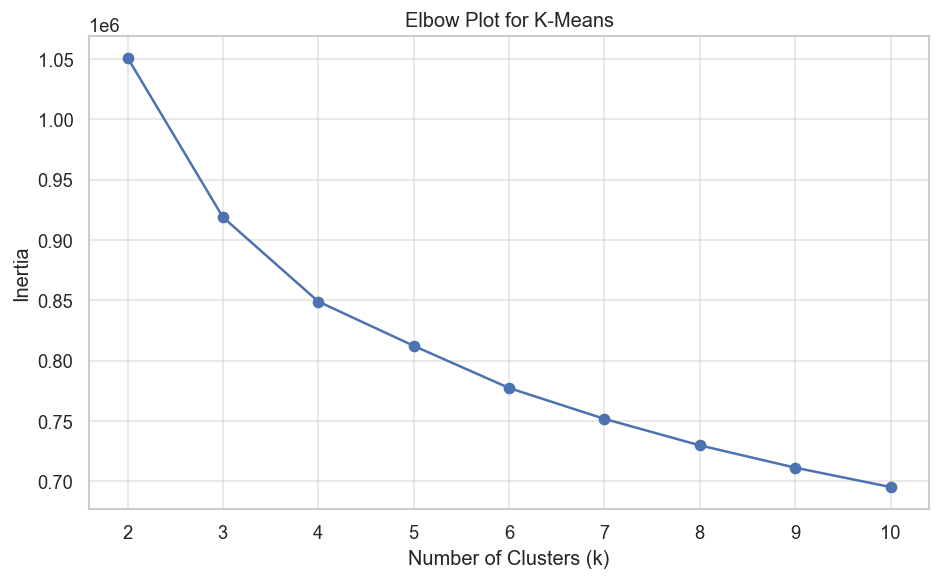
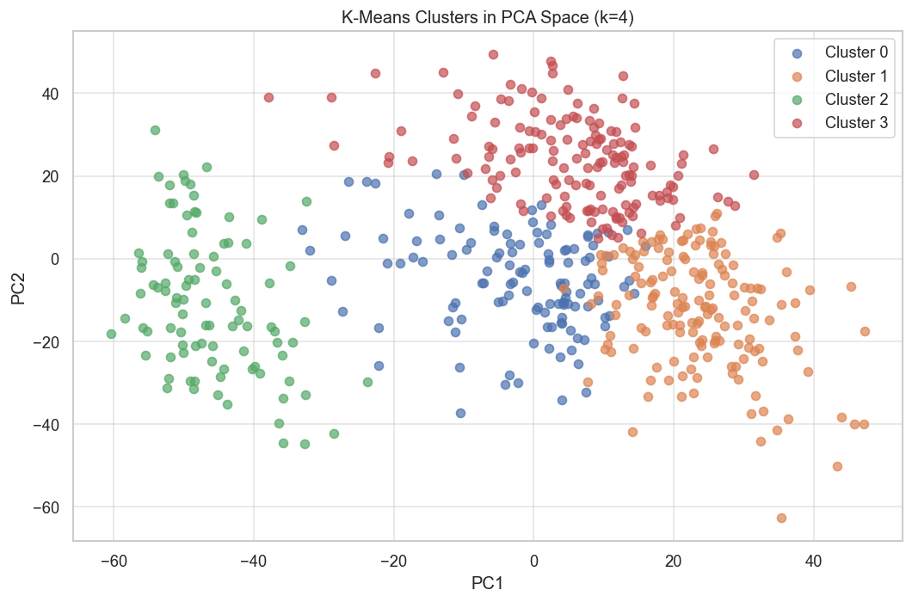

# Can an Algorithm Rediscover What Oncologists Took Decades to Find?

*A data science team at Seattle University applied unsupervised machine learning to breast cancer gene profiles — without giving the algorithm a single label.*

---

## The Question

Breast cancer is not one disease. Oncologists have identified at least four distinct molecular subtypes — **Luminal A**, **Luminal B**, **HER2-enriched**, and **Triple-Negative** — each with different behaviors, prognoses, and treatment responses. Identifying these subtypes took decades of clinical research and required knowing exactly what to look for.

We asked a simpler question: **what if you gave an algorithm 17,000 gene measurements from 529 tumor samples and absolutely no other information? Could it find the same groupings on its own?**

---

## The Data

We used publicly available gene expression data from **The Cancer Genome Atlas (TCGA)**, a landmark NIH project that catalogued the genomics of human cancer at an unprecedented scale. Our dataset contains 529 breast tumor samples, each profiled across 17,814 genes. Every entry is a number representing how actively that gene was expressing itself in that tumor.

Each patient is described by 17,814 continuous numerical gene expression measurements. The high dimensionality is intentional. Our analysis uses PCA to reduce it to a a manageable number of dimensions of components before clustering, which is the standard approach in genomics. Our job was to find hidden patterns in those numbers, with no hints about diagnosis, subtype, or outcome.

> **Data source:** [Kaggle — Gene Expression Profiles of Breast Cancer](https://www.kaggle.com/datasets/orvile/gene-expression-profiles-of-breast-cancer) (originally from TCGA)

---

## Our Approach

We applied four unsupervised learning methods, which are algorithms that learn structure from data without any labels:

| Method | What it does |
|--------|-------------|
| **PCA / SVD** | Compresses 17,000 dimensions down to a handful that capture the most variation |
| **Matrix Completion** | Recovers missing measurements using the low-rank structure of the data |
| **K-Means Clustering** | Partitions patients into groups based on similarity in gene expression |
| **Hierarchical Clustering** | Builds a tree of relationships between patients, revealing nested structure |

---

## What We Found

### Dimensionality Reduction (PCA)

# Finding the Signal in 5,000 Dimensions: What PCA Revealed About Our Tumor Data
When you have 529 tumor samples and each one is described by 5,000 genes, you’re essentially staring at a 5,000-dimensional cloud of points. No human can visualize that, and most algorithms choke on the noise. To extract anything biologically meaningful, we needed a way to compress the data without throwing away the important patterns. Principal Component Analysis (PCA), powered by Singular Value Decomposition (SVD), gave us that tool. It finds the directions in the data where samples differ the most, and projects everything down to something we can actually look at and work with. 

# How much signal is in those first few dimensions?
The first sanity check is always a scree plot: a bar chart showing how much total variance each principal component (PC) captures. The first component accounted for 13.1% of the cross-sample variation, and the second captured 8.2%. After that, the curve dropped sharply and flattened into a long, quiet tail. That classic “elbow” shape tells us something important: most of the meaningful variation lives in just a handful of dimensions. The data isn’t spraying randomly in all 5,000 directions-there’s real, low-dimensional structure waiting to be uncovered.

# Visualizing the tumors in two dimensions
We plotted every tumor using only PC1 and PC2. The result wasn’t a formless blob. Instead, clear groupings and smooth gradients emerged organically. What makes this compelling is that the algorithm never saw a clinical label. It had no information about cancer subtypes, patient outcomes, or histology. It only saw expression values, yet the samples naturally grouped together. That was our first real confirmation that the underlying biology is strong enough to drive separation on its own.
To be sure this wasn’t some trick of projection, we ran a simple control: we plotted the same samples using two randomly chosen genes. Unsurprisingly, that gave us a scattered, unstructured mess. Think of it like trying to recognize a complex 3D object from a bad angle. PCA solves for the exact rotation that reveals the widest, most informative silhouette. Two random genes don’t even come close.

# What genes drive the separation?
PCA doesn’t just reduce dimensions-it also tells you which original features contribute most to each component. When we examined the gene loadings for PC1, the strongest contributors were MLPH and FOXA1. In the math, they were just indices in a matrix. In reality, both genes are well-established markers of estrogen receptor signaling and are routinely used to classify luminal breast cancers. Without any biological guidance, the math landed on the same genes that decades of pathology research have identified as central. That convergence between purely mathematical results and known biology gives us confidence that the structure we’re seeing is genuine.

# How many components do we actually need?
PC1 and PC2 are great for visualization, but they don’t tell the whole story. For downstream clustering, we asked a practical question: how many components are required to capture at least 50% of the cumulative variance? The answer turned out to be 24.
That number is revealing. Breast cancer is often discussed in terms of four major clinical subtypes, so you might guess that three or four components would suffice. The fact that 24 are needed highlights the hidden complexity in tumor tissue. Beyond subtype identity, there are multiple independent sources of variation-immune infiltration, metabolic state, patient age, stromal content, secondary mutations-each showing up in the data in its own way. By keeping these 24 components, we reduced our feature space by more than 99% while still preserving the biological signals that matter for clustering and interpretation.

# The takeaway
PCA didn’t just shrink our dataset; it confirmed that the underlying biology is strong, recoverable, and aligns with known clinical markers. The structured groups we see in PC space, the gene loadings that match established pathways, and the dimensionality needed to explain half the variance all point in the same direction: the data contains real, layered information about tumor biology, and we’re now equipped to explore it in a far more tractable form.

### Handling Missing Data (Matrix Completion)

Gene expression data collected across different labs and platforms often contains gaps. We demonstrated that...

### K-Means Clustering

> *[FILL IN: Describe the elbow plot result, silhouette score at k=4, cluster sizes, and what the clusters look like in PCA space. Include the elbow plot and PCA scatter.]*

When we asked the algorithm to find four natural groupings (matching the four known subtypes), we found...

<!--  -->
<!--  -->

### Hierarchical Clustering

Building a family tree of the tumor samples revealed...

---

## The Bigger Picture

---

## What This Means

This project is a proof of concept for something profound: the biological structure of breast cancer is so deeply encoded in gene expression that an algorithm with zero clinical knowledge can begin to find it.

This matters for a few reasons:

- In cancers or diseases where subtypes aren't yet well-characterized, unsupervised methods like these can generate hypotheses for future research.
- As genomic profiling becomes cheaper and more routine, these methods will help make sense of massive datasets that no human team could review manually.
- It raises an interesting question about what "knowledge" really is — and how much structure in biology is waiting to be found by the right mathematical lens.

---

## About This Project

This analysis was completed as a final project for **DATA 5322 — Statistical Machine Learning II** at Seattle University, Spring 2026.

**Team:** Ruman Sidhu, Paul Skentzos, Hamda Hassan  
**Instructor:** Dr. Ariana Mendible  
**Code & notebooks:** [GitHub Repository](https://github.com/[YOUR-REPO-LINK])

---

*All analysis was performed in Python using scikit-learn, scipy, pandas, matplotlib, and seaborn. Data is from the public domain via TCGA and Kaggle.*
